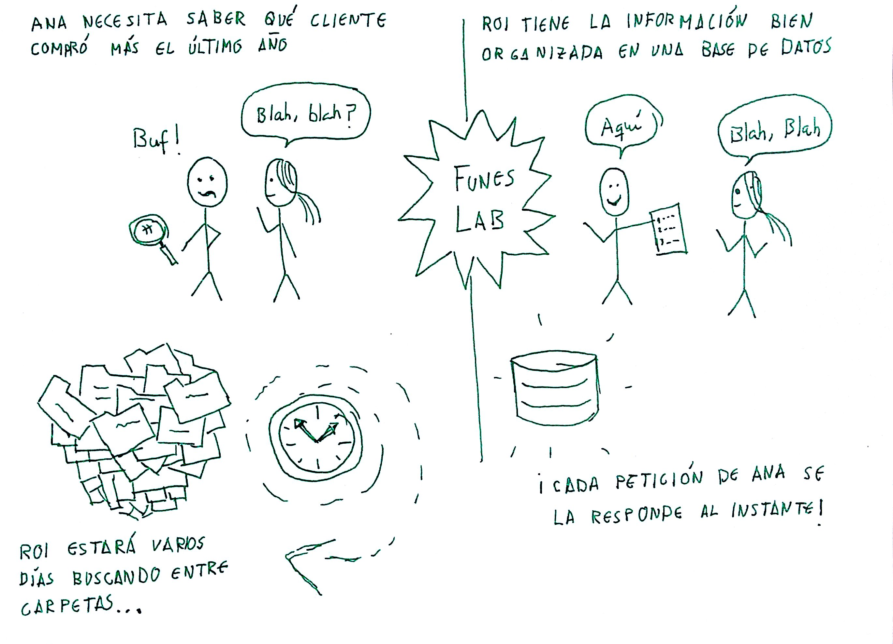
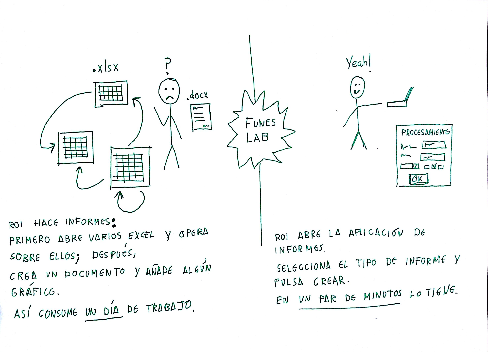
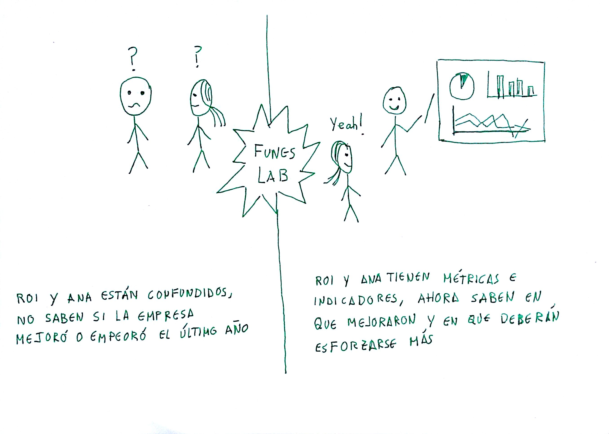
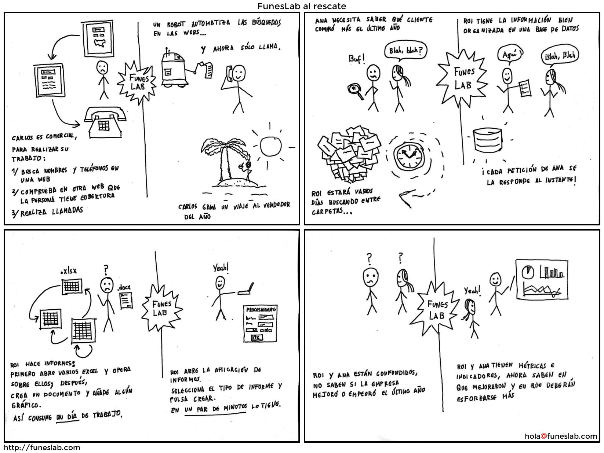

# Intro

A Python script to compose cartoon strips from images.

# Example

Input:








Default output (`-c 1`):


Output with `-c 4` option:


Output with `-c 2` option:




# Description

1. Put images in a dir with `jpg` extension file (downcase),
2. Run the script with the appropiate arguments and
3. End

The image order is file name alphabetical.

It is important that, using the default directory, the extension of the output
file was `JPG` upcase. Because if it is `jpg` and you run the script again the
output image will be included.

Options:

* `-d` Directory. Default, where the file is called.
* `-r` RGB. Default black and white.
* `-c` Number of columns.
* `-o` Output file image. Default `OUTPUT.JPG`

```
$ python cartoon.py -h
usage: cartoon.py [-h] [-d DIRECTORY] [-t TITLE] [-u URL] [-e EMAIL]
                  [-c COLUMNS] [-r] [-o OUTPUT]

Tile images and add labels.

optional arguments:
  -h, --help            show this help message and exit
  -d DIRECTORY, --directory DIRECTORY
  -t TITLE, --title TITLE
  -u URL, --url URL
  -e EMAIL, --email EMAIL
  -c COLUMNS, --columns COLUMNS
  -r, --rgb
  -o OUTPUT, --output OUTPUT
```
